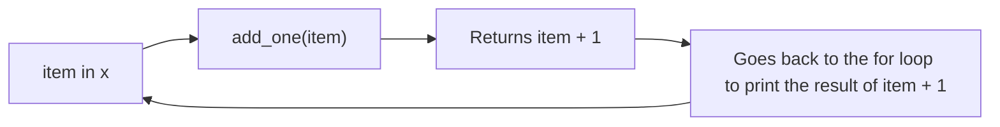

# Project 1 Useful Python Programming

Here's a list of useful snippets of Python Programming for Part 1 of Project 1

## Lists
[Python Lists from W3Schools](https://www.w3schools.com/python/python_lists.asp)

Lists allow you to have multiple items in a single variable. This can be useful for this project when storing the values
that you might need to loop (iterate) through.

```Python
x = [1.0, 2.0, 3.0]
y = [2.0, 1.2, 3.3]
```

## Loops
[Python - Loop Lists from W3Schools](https://www.w3schools.com/python/python_lists_loop.asp)

There are a few different ways to loop through a list. 

### For Loop
[For loops from W3Schools](https://www.w3schools.com/python/python_for_loops.asp)

For loops iterate through a list and go through each result one by one.
```Python
for i in x: 
    print(i) # Print the individual result to console
```
Output:
``` 
1.0 
2.0 
3.0
```

### While Loop
[while loop](https://www.w3schools.com/python/python_while_loops.asp)

A while loop will increase a variable to a specified condition until that condition is met. You can then state the specific number
of the item in the list that you want to output with the i variable.
```Python
i=0 # initiate a number to use as a count to increase during the loop 
# len(variable) is a built-in Python function that gives you the length of the list
while i < len(x): 
    print(x[i]) # Print the result to console
    i += 1 # Increase the i variable by 1
```

Output:
``` 
1.0 
2.0 
3.0
```

Use whichever one you feel more comfortable with, especially for a data set this small.

## Functions
[Functions from W3Schools](https://www.w3schools.com/python/python_functions.asp)

Functions will allow you to re-use a block of code over and over again while also allowing you to change the input
based on the parameter you define.

### Example
Let's say we want to add 1 to each number in the x list. First we can define a function that accepts an input of number.
```Python
def add_one(number):
    return number + 1
```
When we run the function it will return the input parameter and add 1 to it. Now let's use that in a for loop:
```Python
for i in x:
    print(add_one(i))
```

This will loop through the x list and run add_one on each item in the list. It looks a little like this:


and does that **for** each **i**tem in **x**.

So the for loop output would now be:
``` 
2.0 
3.0 
4.0
```

## Importing libraries and useful libraries
There may be times that base Python will not have the functions you need. So you will need to import external libraries to
help you out with your code.

One of the ones that will be helpful for this class is NumPy. To import NumPy place this code at the beginning of your code:
```Python
import numpy
```
If you are on Colaboratory, Google already has this installed and it will import seamlessly. If you are using PyCharm you may see a
little error message asking you to install NumPy locally. Just click install and wait a few seconds while it brings NumPy into your
environment.

### Numpy Usage
[Math functions in NumPy](https://numpy.org/doc/stable/reference/routines.math.html)

NumPy has a lot of useful functions for math and linear algebra. For this example we're only going to go over the power function
as it helps us solve this particular part.

Once NumPy is imported, to use the power function all you need to do is use this code:
```Python
numpy.power(number,exponent)
```
This will allow you to put in a number and the power to which you need to calculate. For example:
```Python
numpy.power(2.0,2) 
```
will output:
``` 
4.0
```


## Putting it all together
See if you can follow this code along with all of the examples from above.
```Python
import numpy

x = [2.0, 3.0, 4.0]

def square_number(number):
    return numpy.power(number,2)
    
for i in x:
    print(square_number(i))
```

If your environment is all set up correctly and you followed the code your output should be:
``` 
4.0
9.0
16.0
```